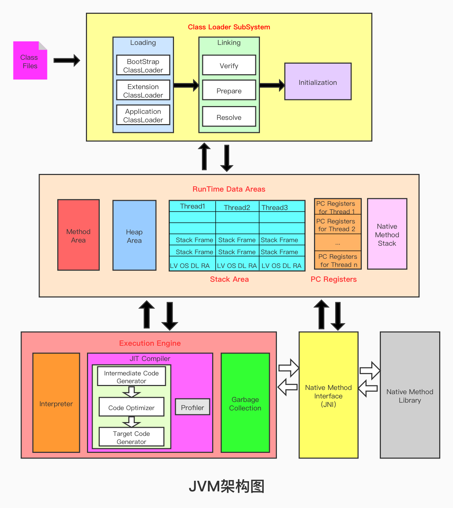
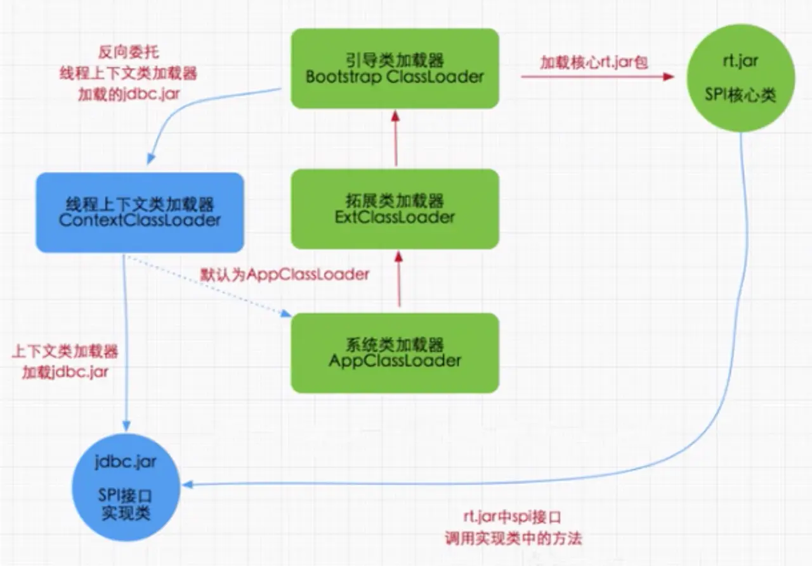

### 类加载过程




- 初始化阶段就是执行类构造器方法clinit（）的过程。
- 此方法不需要定义，是javac编译器自动收集类中的所有类变量的赋值动作和静态代码块中的语句合并而来。 `我们注意到如果没有静态变量c，那么字节码文件中就不会有clinit方法`

<clinit> 需要静态代码块或者静态变量。

ctrl+SHIFT+T 搜索各种类


查看类之间继承关系：idea下快捷键F4或者右键diagram

变量名后面跟.vaR 直接获取赋值方法


**反向委托。具体实现由ContextClassLoader获取具体类实现**




## 沙箱安全机制

自定义String类，但是在加载自定义String类的时候会率先使用引导类加载器加载，而引导类加载器在加载过程中会先加载jdk自带的文件（rt.jar包中的java\lang\String.class）,报错信息说没有main方法就是因为加载的是rt.jar包中的String类。这样可以保证对java核心源代码的保护，这就是**沙箱安全机制**.


## 在jvm中表示两个class对象是否为同一个类存在的两个必要条件

- 类的完整类名必须一致，包括包名
- 加载这个类的ClassLoader（指ClassLoader实例对象）必须相同

换句话说，在jvm中，即使这两个类对象（class对象）来源同一个Class文件，被同一个虚拟机所加载，但只要加载它们的ClassLoader实例对象不同，那么这两个类对象也是不相等的.


## 类的主动使用和被动使用

- 主动使用

  1. 创建类的实例
  2. 访问某各类或接口的静态变量，或者对静态变量赋值
  3. 调用类的静态方法
  4. 反射 比如Class.forName(com.dsh.jvm.xxx)
  5. 初始化一个类的子类
  6. java虚拟机启动时被标明为启动类的类
  7. JDK 7 开始提供的动态语言支持：
      java.lang.invoke.MethodHandle实例的解析结果REF_getStatic、REF_putStatic、REF_invokeStatic句柄对应的类没有初始化，则初始化

  

- 被动使用

  不会导致类的初始化。


对于栈不存在垃圾回收问题。PC没有GC和OOM，栈没有GC，有OOM


## 栈中可能出现的异常

java虚拟机规范允许**Java栈的大小是动态的或者是固定不变的**

- 如果采用固定大小的Java虚拟机栈，那每一个线程的java虚拟机栈容量可以在线程创建的时候独立选定。如果线程请求分配的栈容量超过java虚拟机栈允许的最大容量，java虚拟机将会抛出一个 **StackOverFlowError**异常

  ```java
  /**
   * 演示栈中的异常
   */
  public class StackErrorTest {
      public static void main(String[] args) {
          main(args);
      }
  }
  
  ```

  - 如果java虚拟机栈可以动态拓展，并且在尝试拓展的时候无法申请到足够的内存，或者在创建新的线程时没有足够的内存去创建对应的虚拟机栈，那java虚拟机将会抛出一个 **OutOfMemoryError异常**

- -Xss 最小要为108k,不然虚拟机启动不了。


## 栈帧的内部结构

每个栈帧中存储着：

- **局部变量表**（Local Variables）
- **操作数栈**（Operand Stack）(或表达式栈)
- 动态链接（Dynamic Linking）(或执行运行时常量池的方法引用)
- 方法返回地址（Return Adress）（或方法正常退出或者异常退出的定义）
- 一些附加信息


class文件常量池和运行时常量池，符号引用和直接引用的区别


## 虚方法和非虚方法

非虚方法

- 如果方法在编译器就确定了具体的调用版本，这个版本在运行时是不可变的。这样的方法称为非虚方法
- **静态方法、私有方法、final方法、实例构造器、父类方法都是非虚方法**
- 其他方法称为虚方法

##### 虚拟机中提供了以下几条方法调用指令：

普通调用指令：
 1.invokestatic：调用静态方法，解析阶段确定唯一方法版本；
 2.invokespecial:调用方法、私有及弗雷方法，解析阶段确定唯一方法版本；
 3.invokevirtual调用所有虚方法；
 4.invokeinterface：调用接口方法；
 动态调用指令：
 5.invokedynamic：动态解析出需要调用的方法，然后执行 .
 前四条指令固化在虚拟机内部，方法的调用执行不可人为干预，而invokedynamic指令则支持由用户确定方法版本。其中**invokestatic指令和invokespecial指令调用的方法称为非虚方法，其余的（final修饰的除外）称为虚方法。**

1.2，编译期间就可以确定

没有显示调用父类方法，子类没有重写：invokevirtual，但是如果在父类中如果被final修饰则是非虚方法。

如果继承的父类与实现的接口有相同的方法，则子类必须重写，否则找不到。

```java
    public static String method4(){
        StringBuilder s1 = new StringBuilder();
        s1.append("a");
        s1.append("b");
        return s1.toString();
    }


```

操作：是线程安全的 ，StringBuilder的toString方法是创建了一个新的String，s1在内部消亡了

StringBuffer是线程安全的，StringBuilder不是

局部变量基本数据类型安全，引用类型可能不安全。