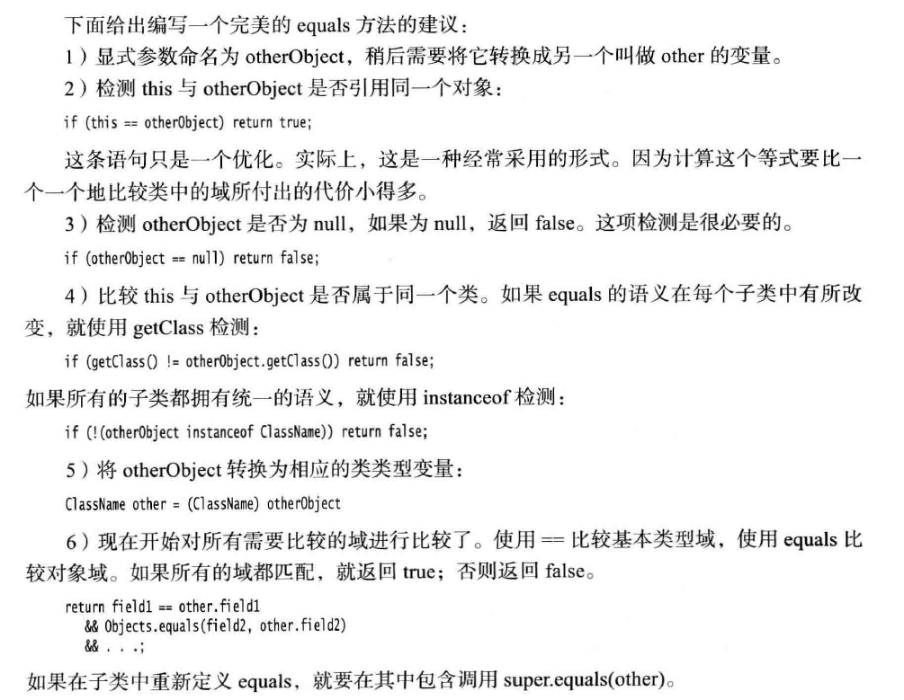

[TOC]


## 超类与子类

只能在继承层次内进行类型转换。

在将超类转换成子类之前，应该使用instanceof进行检查。

null instanceof C 不会产生异常，返回false.

## 抽象类与抽象方法

类即使不含抽象方法，也可以将类声明为抽象类。

抽象类的变量只能引用非抽象子类对象。

### Object类：所有类的超类

所有的数组类型，不管是对象数组还是基本类型的数组都扩展了Object类。

```java
Employee[] staff=new Employee[10];
obj=staff;
obj=new int[10];
```

Object.equals可以判断参数是否为null,两者都为null返回true,一个为null,返回false.

两者都不为null,可以调用a.equals(b)。


区别就是`getClass()`限制了对象只能是同一个类，而`instanceof`却允许对象是同一个类或其子类，这样`equals`方法就变成了父类与子类也可进行`equals`操作了，这时候如果子类重定义了`equals`方法，那么就可能变成父类对象`equlas`子类对象为`true`，但是子类对象`equlas`父类对象就为`false`了

### 重写equals的建议



对于数组类型的域，可以调用Arrays.equals

### Hashcode()

Object中hashcode的默认实现时地址。StringBuilder因为没有重写hashCode,散列码有Object的默认hashCode方法导出对象的存储地址，一般不同。字符串s与t有相同的散列码，因为字符串的散列码是用内容导出的。

### 对象包装器与自动装箱

两个包装器对象比较时调用equals方法。

Integer对象不可变，包含在包装器中的内容不会改变。不能使用这些包装器类创建修改数值参数的方法。

**System.arraycopy()** 浅复制。Arrays.copyOf 同理

对于一维数组来说，这种复制属性值传递，修改副本不会影响原来的值。对于二维或者一维数组中存放的是对象时，复制结果是一维的引用变量传递给副本的一维数组，修改副本时，会影响原来的数组。

Arrays.copyOf()是创建一个新的数组（也就是分配了一个新的内存空间），然后调用System.arraycopy()复制内容，赋值给新数组，然后返回新数组。

对于数值类型的数组是深拷贝，对于引用类型是浅拷贝

**使用序列化实现深拷贝**

```java
implements Serializable
/**
     * 使用序列化技术实现深拷贝
     * @return
     */
    public YuelyLog deepClone() throws IOException,ClassNotFoundException{
        //将对象写入流中
        ByteArrayOutputStream outputStream = new ByteArrayOutputStream();
        ObjectOutputStream objectOutputStream = new ObjectOutputStream(outputStream);
        objectOutputStream.writeObject(this);
        //从流中取出
        ByteArrayInputStream inputStream = new ByteArrayInputStream(outputStream.toByteArray());
        ObjectInputStream objectInputStream = new ObjectInputStream(inputStream);
        return (YuelyLog)objectInputStream.readObject();

    }
```

**继承的设计技巧**

1. 将公共操作和域放在超类

2. 不要使用受保护的域

   java中同一个包中所有类都可以访问protected域。

3. 使用继承实现“is-a”关系

4. 除非所有继承的方法都有意义，否则不要使用继承。

5. 在覆盖方法时，不要改变预期的行为。

6. 使用多态，而非类型信息。

7. 不要过多的使用反射。

   # 接口和lambda表达式

## 接口

接口中可以定义常量，不能有实例域，Java SE 8之前，不能在接口中实现方法。

实现 compareTo 的时候调用了 Double .compare ,也可以调用Integer .compare，如果绝对值不超过（Integer .MAX_VALUE-1）/2，也可以直接id-other.id。

再调用方法的时候，编译器将会检查这个方法是否存在，即这个对象是否可以调用这个方法。

**类优先原则**

扩展一个超类，同时实现了一个接口，并从超类和接口继承了相同的方法。只会考虑超类方法，接口的所有默认方法都会被忽略。

因此不能为 toString 或 equals 定义默认方法。、

设置时间

```java
private Date hireDay;
public void setHireDay(int year,int month,int day){
	Date newHireDay=new GregorianCalendar(year,month-1,day).getTime();
	hireDay.setTime(newHireDay.getTime());
}
```


## lambda

