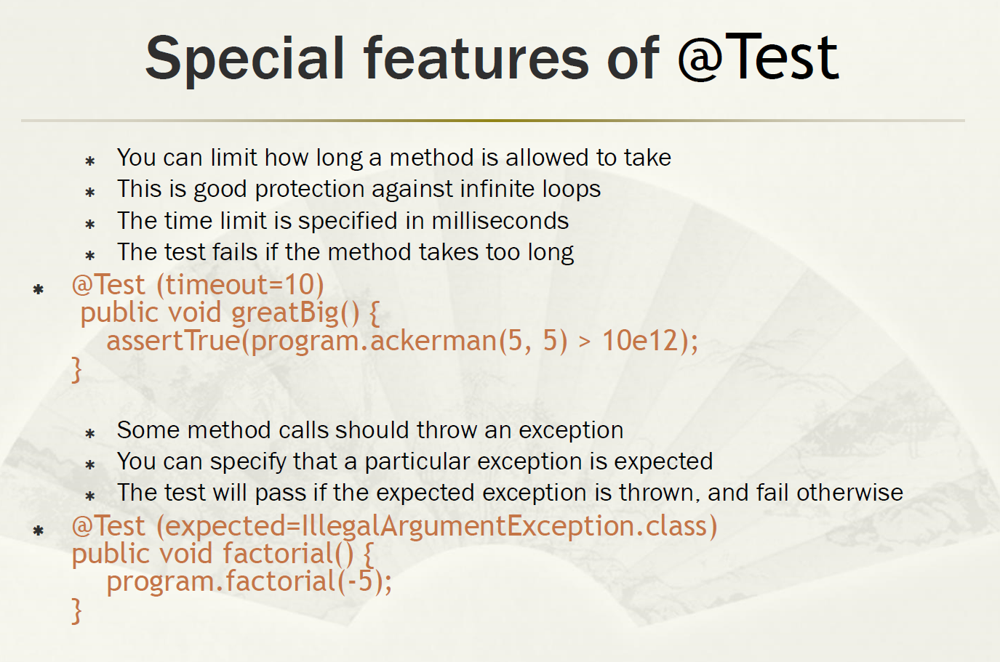

# 构造函数与静态工厂方法

 但要把这个构造函数添加到 Child 类中，我们都知道是行不通的，因为 java 的函数签名是忽略参数名称的，所以 `Child(int age)` 跟 `Child(int weight)` 会冲突。

# 重写Equals方法

1. equals必须使用Instanceof 而不能用getClass 因为比较的时候Object O 可能传进来子类对象。

2. Override注解

3. 总是重写HashCode

4. 自反，对称，传递，一致性。

5. Don’t throw NullPointerException or ClassCastException    

   ​    

   ​    

# 重写Clone方法

First, CloneNotSupportedException is thrown if the class of this object does not implement the interface Cloneable.
Note: arrays are considered to implement the interface Cloneable.

# 重写compareTo方法

compareTo() can throwClassCastExceptions

# JUnit

